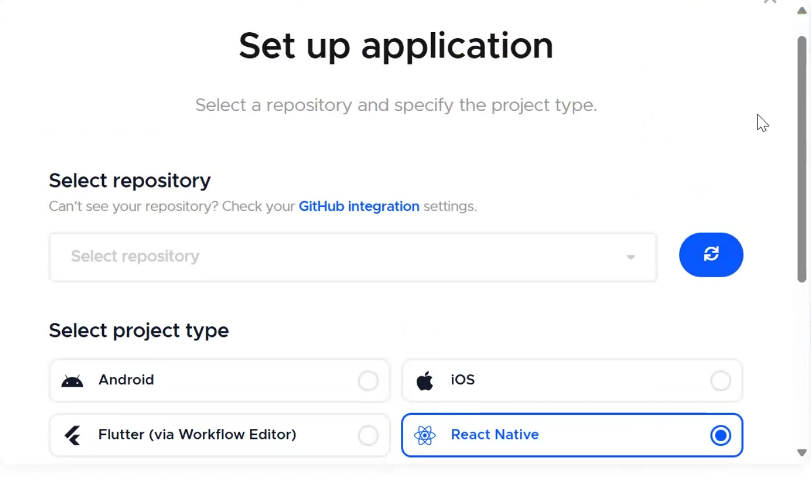
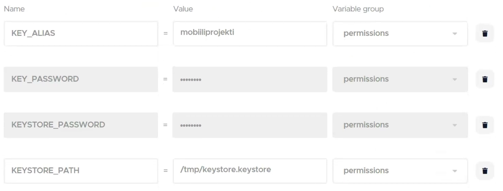
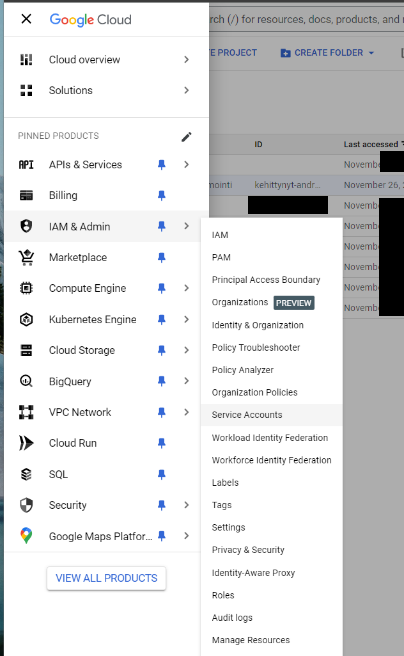
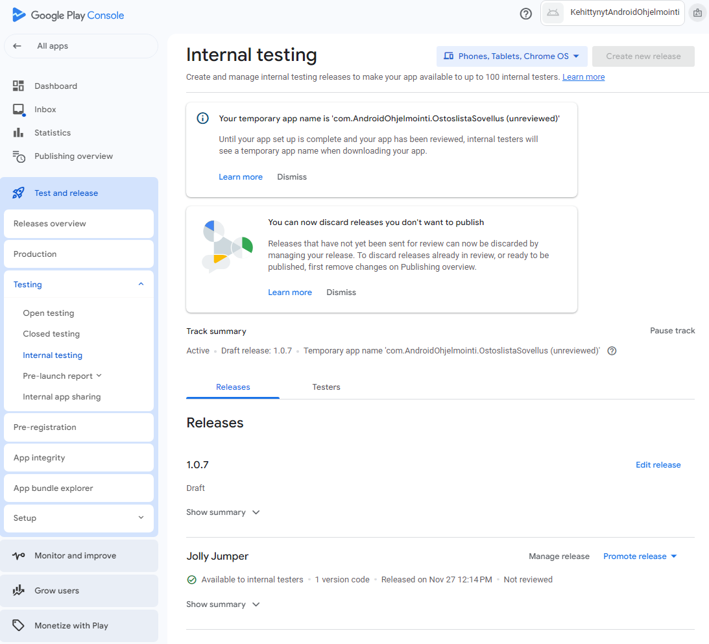
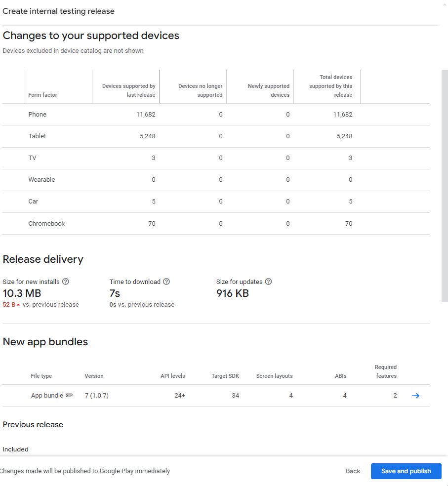

# Expo App -sovelluksen julkaisu Google Playhin Codemagicilla

### 

# Sisällys

[Expo App -sovelluksen julkaisu Google Playhin Codemagicilla
[1](#expo-app--sovelluksen-julkaisu-google-playhin-codemagicilla)](#expo-app--sovelluksen-julkaisu-google-playhin-codemagicilla)

[Valmistele React Native -sovelluksesi
[1](#valmistele-react-native--sovelluksesi)](#valmistele-react-native--sovelluksesi)

[Luo Codemagic-tili [3](#luo-codemagic-tili)](#luo-codemagic-tili)

[Codemagic.yaml [4](#codemagic.yaml)](#codemagic.yaml)

[Muokkaa build.gradle- tiedostoa
[11](#muokkaa-build.gradle--tiedostoa)](#muokkaa-build.gradle--tiedostoa)

[Luo Google Play -julkaisutili, uusi projekti ja luo projektiin uusi
julkaisu
[12](#luo-google-play--julkaisutili-uusi-projekti-ja-luo-projektiin-uusi-julkaisu)](#luo-google-play--julkaisutili-uusi-projekti-ja-luo-projektiin-uusi-julkaisu)

[Luo Service Account automaattista Uploadaamista varten
[19](#luo-service-account-automaattista-uploadaamista-varten)](#luo-service-account-automaattista-uploadaamista-varten)

[Lisätään Service Accountin avain Codemagicin ympäristömuuttujiin
[23](#lisätään-service-accountin-avain-codemagicin-ympäristömuuttujiin)](#lisätään-service-accountin-avain-codemagicin-ympäristömuuttujiin)

## Valmistele React Native -sovelluksesi

Valitse haluamasi repository jonka haluat buildata

Esimerkin julkista repositoriota voi käyttää testauksessa:

https://github.com/jonezki01/ReactNativeBuild.git

Voidaksemme yhdistää repo CodeMagiciin sen tulee olla omalla github
tililläsi.

Kloona repo githubissa omalle tilillesi samalla nimellä:

git clone https://github.com/OMATUNNUSTÄHÄN/ReactNativeBuild.git

cd ReactNativeBuild

npm install

Sovelluksen buildaaminen ja toiminta kannattaa testata ensin esimerkiksi
eas:lla.

(tähän linkki jonezkin testirepoon)

Aja prebuild saadaksesi build.gradle tiedosto jota täytyy muokata
myöhemmin codemagicia varten.

npx expo prebuild:  

Yllä oleva komento luo android/ kansion. Ota sieltä talteen tiedosto
android/app/build.gradle tiedosto siirtämällä se kansioon support-files/

mkdir support-files

mv ./android/app/build.gradle ./support-files/

voit tuhota android/ kansion:

rm -rf ./android

Voit tarkistaa tiedoston tallentumisen support-files kansioon
komennolla:

ls support-files/

## Luo Codemagic-tili

Mene [Codemagicin](https://codemagic.io) sivustolle ja luo tili.

Lisää aplikaatio -&gt; yhdistä GitHub-tili

Jos repoja ei näy paina Check your GitHub integration settings ja
valitse joko vain yksi repo tai vaikka kaikki:

Paina päivitä-nappia niin repon tulisi näkyä:  

valitse projektityypiksi React Native ja Finish: Add application.

## Codemagic.yaml

Esimerkkirepossa on codemagic.yaml-tiedosto joka määrittelee buildin
etäkoneella.

Codemagic antaa tiedostosta virheilmoituksia koska ympäristömuuttujia ei
ole määritelty palvelimelle.

Esimerkkirepositio sisältää codemagic.yaml-tiedoston juurikansiossa:

workflows:

\# Tiedostossa voi olla useita workflow osioita

\# esim. androidille develepor buildi ja production buildi ominaan ja
ios omanaan.

\# Tässä olemme toteuttaneet vain yhden workflown androidille.

  react-native-android:

    name: React Native Android \#workflown nimi Codemagicissä

    max\_build\_duration: 30 \# buildin maksimi kesto minuutteina ennen
kuin se keskeytetään

    instance\_type: mac\_mini\_m2 \# buildin suoritusympäristö
(mac\_mini\_m1, mac\_mini\_m2, linux yms.)

    environment: \# tässä voidaan määritellä suoritusympäristön
ympäristömuuttujia ja työkalujen versioita

      java: 17

      groups:

        - permissions \#keystore ja gcloud service account key

        - email \# build ilmoitusten sähköpostit

        - env\_vars \# ympäristömuuttujat

      vars:

        \# Tähänkin voi määritellä ympäristömuuttujia

        \# esim package name on sama kuin app.json ja
support-files/build.gradle tiedostossa

        PACKAGE\_NAME: "com.AndroidOhjelmointi.OstoslistaSovellus"

    \# Tässä voidaan määritellä workflow käynnistymään automaattisesti

    \# esim. push, tag, pull\_request githubissa voi käynnistää uuden
buildin

   # triggering:

   #   events:

   #     - push

   #     - tag

   #     - pull\_request

   #   branch\_patterns:

   #     - pattern: main

   #       include: true

   #       source: true

    scripts:

        \# Tässä määritellään buildin vaiheet scripteillä

      - name: Expo public environment variables

        \# Jos buildissa tarvitaan .env tiedostoa, se voidaan luoda
tässä

        \# WEATHER\_API\_KEY:tä voi reactissa käyttää myös:
process.env.WEATHER\_API\_KEY ilman .env tiedostoa

        \# koska Codemagicin ympäristömuuttujat ovat käytettävissä myös
reactissa

        \#script: |

        \#echo "WEATHER\_API\_KEY=$WEATHER\_API\_KEY" &gt;&gt;
$CM\_BUILD\_DIR/.env

      - name: Install npm dependencies

        \# npm install asentaa projektin riippuvuudet package.json
tiedostosta suoritusympäristöön

        script: |

          npm install

      - name: Run Expo Prebuild

        \# Expo prebuild luo tarvittavat tiedostot android buildia
varten

        script: |

          npx expo prebuild

      - name: Set Android SDK location

        \# Android SDK location määritellään local.properties tiedostoon

        script: |

          echo "sdk.dir=$ANDROID\_SDK\_ROOT" &gt;
"$CM\_BUILD\_DIR/android/local.properties"

      - name: Set up app/build.gradle

        \# Siirretään Codemagicia varten tehty build.gradle tiedosto
android/app kansioon

        script: |

          mv ./support-files/build.gradle android/app

      - name: Set up keystore

        \# Keystore tiedosto on syötetty Codemagicin ympäristömuuttujaan
$KEYSTORE base64 koodattuna

        \# Tässä dekoodataan se ja tallennetaan /tmp kansioon

        script: |

          echo $KEYSTORE | base64 --decode &gt; /tmp/keystore.keystore

          \# Alla oleva komento luo key.properties tiedoston android
kansioon

          \# ja määrittelee keystore tiedoston sijainnin, aliaksen ja
salasanat

          cat &gt;&gt; "$FCI\_BUILD\_DIR/android/key.properties"
&lt;&lt;EOF

          storePassword=$KEYSTORE\_PASSWORD

          keyPassword=$KEY\_PASSWORD

          keyAlias=$KEY\_ALIAS\_USERNAME

          storeFile=/tmp/keystore.keystore

          EOF

      - name: Debuggailua

        \# Tässä olen lisännyt debuggailua varten komentoja

        script: |    

          echo "Display env file"

          cat $CM\_BUILD\_DIR/.env

          echo "Displaying key.properties contents:"

          cat "$FCI\_BUILD\_DIR/android/key.properties" || echo "Error:
Unable to display key.properties"

          echo "Listing contents of /tmp directory:"

          ls -la /tmp || echo "Error: Unable to list /tmp directory"

          echo "Displaying keystore details:"

          ls -la /tmp/keystore.keystore || echo "Error: keystore file
not found"

          echo "displaying FCI\_BUILD\_DIR"

          echo $FCI\_BUILD\_DIR

          echo "displaying CM\_BUILD\_DIR"

          echo $CM\_BUILD\_DIR

      - name: Build Android release

        \# Varsinainen android build komento

        \# versionCode ja versionName määritellään tässä

        \# Aluksi tarkistetaan google playsta viimeisin buildin numero
ja lisätään siihen yksi

        \# Jos google playsta ei löydy buildin numeroa, käytetään
defaulttina BUILD\_NUMBER ympäristömuuttujaa

        script: |

          LATEST\_GOOGLE\_PLAY\_BUILD\_NUMBER=$(google-play
get-latest-build-number --package-name "$PACKAGE\_NAME")

          if \[ -z $LATEST\_GOOGLE\_PLAY\_BUILD\_NUMBER \]; then

              \# fallback in case no build number was found from google
play. Alternatively, you can \`exit 1\` to fail the build

              UPDATED\_BUILD\_NUMBER=$BUILD\_NUMBER

              echo "no build number found from google play"

              \#exit 1

          else

             
UPDATED\_BUILD\_NUMBER=$(($LATEST\_GOOGLE\_PLAY\_BUILD\_NUMBER + 1))

          fi

          cd android

          ./gradlew bundleRelease \\

            -PversionCode=$UPDATED\_BUILD\_NUMBER \\

            -PversionName=1.0.$UPDATED\_BUILD\_NUMBER

    artifacts:

      \# Tässä määritellään buildin jälkeiset tiedostot, jotka halutaan
tallentaa

      \# esim. .aab tiedosto julkaistavaksi google playhin

      - android/app/build/outputs/\*\*/\*.aab

    publishing:

      \# Tässä määritellään mihin buildin jälkeiset tiedostot
julkaistaan

      email:

        \# Tässä määritellään kenelle buildin onnistumis- ja
epäonnistumisilmoitukset lähetetään

        recipients:

          - $EMAIL1

        notify:

          success: true

          failure: true

\# App täytyy julkaista google playhin manuaalisesti ensimmäisen kerran
ennen kuin se voidaan julkaista automaattisesti          

\#      google\_play:

\#        credentials: $GCLOUD\_SERVICE\_ACCOUNT\_CREDENTIALS

\#        track: internal

\#        submit\_as\_draft: true

Lisätään ympäristömuuttujia codemagicin sivuilla:  
  

Ympäristömuuttujille annetaan nimi, arvo ja ryhmä.  
Securessa kun on ruksi niin arvo piiloutuu tässä ja sen lisäksi vaikka
sen build ympäristössä echottaisi esille, tulos olisi vain rivi tähtiä.

Muistaa painaa Add groupin luomisen jälkeen

Luodaan aplikaation allekirjoitusavain Javan keytoolilla, aja seuraava
komento esmes git bash komentoikkunassa:  
  
keytool -genkeypair -v -storetype PKCS12 -keystore uploadkey.keystore
-alias TÄHÄNOMANAVAIMENNIMI -keyalg RSA -keysize 2048 -validity 10000

Tässä tapauksessa keystoren ja sinne tallennetun avaimen salasana voi
olla sama. Pistä salasa hyvään talteen.

  
  
Keystore on binäärinä ja jotta se voidaan tallentaa codemagicin
ympärisömuuttujiin täytyy se ensin muuntaa tekstiksi koodaamalla se
base64-muotoon:

openssl base64 -in uploadkey.keystore -out uploadkey.keystore.base64

Aukaise luotu tiedosto haluamallasi editorilla ja kopioi avain
leikepöydälle.

Jos loit avaimen reposition sisällä niin kuin tässä esimerkissä pääsi
tapahtumaan niin siirrä se sieltä pois ja turvaan ennen committia…

Liitä avain ympäristömuuttujaksi codemagicissä:  

Lisätään vielä keystoren salasana, avaimen alias, avaimen salasan ja
avaimen sijainti buildympäristössä (viimeisen näistä määritämme
codemagic.yamlissa /tmp/keystore.keystore):

Painamalla check for configuration file virheilmoitusten tulisi kadota
ja voit aloittaa ensimmäisen buildin.

Myöhemmin jos muokkaat codemagic.yamlia niin muista päivittää
configuraatiotiedosto myös codemagicissä:  

Valitse buildattava branchi ja workflow, esimerkissä molempia pitäisi
olla vain yksi.

Voit myös halutessasi enabloida SSH/VNC yhteyden jos haluat ottaa
etäyhteyden buildikoneelle esimerkiksi debuggailua varten. Buildikansio
on ainakin tämän esimerkin ohjeilla /Users/builde/clone

Etäkoneen tutkiskelu on kannattavaa.

Jos ja toivottavasti kun buildi valmistuu näkyy vasemmassa reunassa
linkki .aab bundleen jonka voi ladata Play Storeen. Tallenna tiedosto
koneellesi.

## Muokkaa build.gradle- tiedostoa

build.gradle tiedostoon täytyy muokata (Esimerkkireposition juuressa on
valmis build.gradle tiedosto. Sen nimenä on
com.AndroidOhjelmointi.OstoslistaSovellus, muuta tarvittaessa)

Tarkista että namespace ja applicationId ovat samat kuin
package.jsonissa

Versionumeroiden tulee olla nousevia ja luotiin codemagic.yamlissa:  

Julkaisu tulee signata joko omilla avaimilla kuten tässä esimerkissä tai
sitten play storen uploadavaimilla:

buildtypesin releaseen valitaan signingConfigs.release:

## Luo Google Play -julkaisutili, uusi projekti ja luo projektiin uusi julkaisu

Luo Google Play Developer tili ($25):  
<https://support.google.com/googleplay/android-developer/answer/6112435?hl=en>

Luo projekti:  
<https://developers.google.com/workspace/guides/create-project>

Jos sinulla on useampi projekti niin valitse juuri luomasi projekti (osa
projekteista voi olla piilossa koska näkyviin tulee vain RECENT
projektit):  

Uploadaa tallentamasi .aab bundle, esimerkissä app-release.aab, Play
Storeen.

Avaa [Google Play Console](https://play.google.com/console) ja Create
app:

Anna sovellukselle nimi ja valitse haluamasi vaihtoehdot:  

Haluamme julkaista sovelluksen sisäiseen testiin.

Valitse testaajat luomalla sähköpostilista ja lisäämällä sinne ainakin
yksi testaaja. Testaajan sähköpostiosoite kannattaa olla puhelimeen
liitetty googletili (<postiosoite@gmail.com>).

Muista tallentaa muutokset (sivun oikea alareuna) ja valitse create new
release

Choose signing key:

Valitse Use Google-generated key (voit myös halutessa uploadata luomasi
avaimen):

Uploadaa tallentamasi .aab bundle, esimerkissä app-release.aab

Pysy sivulla niin kauan, että upload on valmis. Lisää Release Name ja
halutessa Release notes:  

Jos upload epäonnistuu (esim. jos sinulla on jo saman niminen
applikaatio tililläsi, com.jotain.Jotain) niin versionumero saattaa
siitäkin huolimatta kasvaa tjsp. Muuta versionumero käsin build.gradle
tiedostoon väliaikaisesti.

  

Sivun oikeaan alareunaan on piilotettu Next-nappi:

Preview and confirm sivu:  

New app bundles kohdassa voi tuosta sinisestä nuolesta selata bundlen
sisältöä ja vaikka ladata .apk paketti Downloads-välilehdeltä testiä
varten ennen publishaamista.

Testers-välilehdeltä löytyy linkki jonka avulla testaajat pääsevät
liittymään soveluksen testaajiin. Vain testaajien listalla olevat
sähköpostiosoitteet voivat testata sovellusta.

Kutsun voi hyväksyä myös selaimessa

Kutsun hyväksymisen jälkeen samasta linkistä saa sovelluksen ladattua
play storesta:

Sovelluksen ladattavaksi ilmestymiseen voi kestää muutamasta minuutista
pariin tuntiin.

## Luo Service Account automaattista Uploadaamista varten

Luo Service Account:  
<https://developers.google.com/android/management/service-account>

IAM & Admin -&gt; Service Accounts

Valitse luomasi projekti, tässä esimerkkissä
Kehittynyt-Android-Ohjelmointi

Valitse Create Service Account

Anna Service Account tiedot

Mene kolmesta pisteestä Manage Keys kohtaan.

Add Key -&gt; Create new key  

Luo private key projektillesi ja laita key type JSON:iksi

Tallenna avain koneellesi turvalliseen paikkaan:

Kopio luomasi service accountin email talteen vaikkapa muistioon:

Enabloi [Google Play Android Developer
API](https://console.developers.google.com/apis/api/androidpublisher.googleapis.com/).

Avaa [Google Play Console](https://play.google.com/console) ja kutsu
uusi käyttäjä:  

Anna talteen laittamasi Service Accountin sähköposti:  

Anna Service Accountille tarvittavat käyttöoikeudet:  

## Lisätään Service Accountin avain Codemagicin ympäristömuuttujiin

Avaa tallentamasi Service Accountin json-muodossa oleva avaintiedosto
esim. vscodessa tai notepadilla ja kopio koko tiedoston sisältö
leikepöydälle.

Siirry codemagicissä sovelluksen asetussivulle ja lisää uusi
ympäristömuuttuja. Liitä Value-kohtaan leikepöydältä json-muodossa oleva
avain, anna muuttujan nimeksi GCLOUD\_SERVICE\_ACCOUNT\_CREDENTIALS ja
lisää muuttuja ryhmään
permissions.

Avaa vscodessa codemagic.yaml tiedosto ja poista tiedoston alimmaisten
rivien edestä kommentointimerkit (risuaidat) kuvan mukaisesti:

$ GCLOUD\_SERVICE\_ACCOUNT\_CREDENTIALS sisältää service accountin
avaimen, track: internal ohjaa aab.bundlen sisäiseen testiin ja
submit\_as\_draft jättää julkaisun odottamaan hyväksyntää.

Jos jouduit muuttamaan versionumeron käsin build.gradle tiedostoon
korjaa muutos nyt:

Kannattaa klikata molempia refreshausnappeja ja jos codemagic ilmoittaa
yamlivirheistä niin ne täytyy korjata ennen kuin voit aloittaa uuden
buildin. Jos kaikki on okei niin ei muuta kuin buildi tulille.

Lisätietoa [Google Play publishing with
codemagic.yaml](https://docs.codemagic.io/yaml-publishing/google-play/)

Jos buildi ja julkaisu onnistui niin uuden version tulisi näkyä Google
Play Consolissa valittuasi luomasi sovelluksen. Testing -&gt; Internal
testing.

Valitse Edit release:

Voit taas tarkastella bundlea nuolesta tai vain painaa Next.  

Vielä yksi tarkastelusivu ja nyt voitkin julkaista sovelluksen sisäiseen
testiin: Save and publish.

Testaajat jotka ovat jo asentaneet sovelluksen edellisen version play
storesta saavat päivityksen automaattisesti puhelimeensa. Puhelimen
asetuksista riippuen sovellus jo täytyy sitten itse päivittää tai se
päivittyy automaattisesti.
